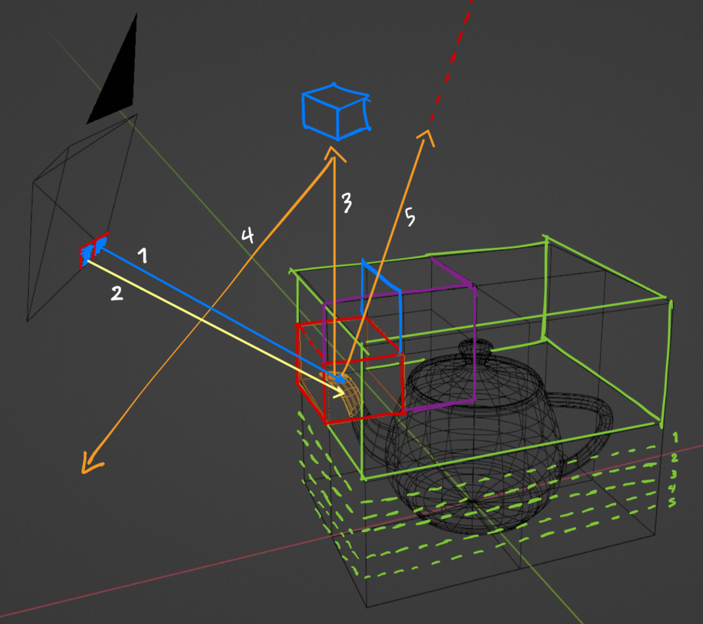

# Optimizing Monte Carlo raytracing through an improved acceleration structure, Caching, and stream compaction

Monte Carlo ray/path tracing produces photorealistic images by simulating light transport, but its brute-force nature is computationally expensive. This project implements a baseline path tracer and evaluates three performance optimizations:

1. **Adaptive SAH-sampling BVH construction (alpha/epsilon decay)** to trade BVH build cost against traversal efficiency.
2. **Caching + cache-coherent traversal (tiling)** to reduce redundant intersection work and improve locality.
3. **Stream compaction** to maintain GPU utilization by removing terminated rays between bounces.

> Implementation: built in **C++**, then ported to **CUDA** for GPU parallelization. No high-level graphics APIs (OpenGL/DirectX) are used.

---

## Figures / Example Renders

---

## Problem Statement

A naive Monte Carlo ray tracer is slow because:

- **Intersection testing is expensive:** naive ray–primitive testing is effectively linear in scene complexity.
- **Rays terminate early:** rays that hit a light source or escape to the environment should stop, but fixed-bounce loops leave many GPU threads idle.
- **Redundant work + poor locality:** many rays, especially at early bounces, access overlapping geometry and repeat similar computations; nearby pixels often hit the same primitives.

This project focuses on optimizing:
- Spatial acceleration via BVH construction
- Utilization via early termination + compaction
- Memory locality via caching and tiling

---

## Optimization Strategies

### 1) Adaptive SAH sampling Bounding Volume Hierarchies (BVH)

A BVH prunes intersection tests by grouping primitives into hierarchical bounding boxes so rays only test geometry in relevant regions.

High-quality BVHs often use the **Surface Area Heuristic (SAH)** to choose split planes, but testing many candidate splits increases BVH construction time.

**Key idea:** use an **alpha/epsilon decay parameter** to sample more split candidates near the **root** and fewer deeper into the tree:
- Better splits near the root matter more (impact many rays).
- Approximate splits near leaves are cheaper to tolerate (few primitives).

This targets a better **overall** trade-off: BVH build time vs traversal (render) time.

---

### 2) Caching and Cache Coherence

Two practical locality improvements:

**A) Cache first-hit intersection (primary rays / repeated samples)**  
At the beginning of sampling, multiple rays fired from the same pixel can be identical (no jitter). If they hit the same primitive, cache the first intersection and reuse it for subsequent samples.

**B) Screen-space tiling**  
Process rays in small pixel tiles so neighboring rays are more likely to traverse similar BVH nodes / access the same geometry, improving cache coherence.

---

### 3) Parallelism and Stream Compaction

Rays that hit a light source or escape to the environment should terminate early. Without intervention, their threads become idle across remaining bounce iterations.

**Stream compaction** removes inactive rays between bounces, producing a dense list of active rays so GPU threads stay useful.

This is implemented via a parallel **prefix sum (scan)**:
- Create a flag array (1 = active, 0 = terminated)
- Prefix-sum the flags to compute new indices
- Scatter active rays into a compacted ray buffer

---

## Experimental Results

### BVH: Construction time vs Rendering time

.png)

.png)

**Observed results:**
- The adaptive BVH **reduces construction time** substantially.
- Rendering time can **increase** when alpha is too high (notably **alpha > 0.6**).
- The best overall trade-off in these experiments occurs around **alpha = 0.8**.

---

### Caching + Tiling

**Observed results:**
- Small tiling (reported around **16 tiles**) performs slightly better than no tiling.
- Larger tiling levels slow down the program (overhead outweighs locality benefits).
- **Caching the first intersection** yields a clear improvement in rendering time.

> Note: first-hit caching depends on repeatedly sampling the exact same pixel ray. With anti-aliasing jitter, sample rays differ and this optimization becomes less applicable.

---

### Stream Compaction: Open vs Closed Scene

**Observed results:**
- **Open scene:** many rays escape quickly:
  - ~50% active after ~5 bounces
  - ~10% active after ~13 bounces  
  → stream compaction yields strong utilization benefits.
- **Closed scene (Cornell box):** fewer rays terminate (mostly those that hit the light), so gains are smaller.

---

## Summary

This project demonstrates that meaningful speedups in Monte Carlo path tracing come from attacking multiple bottlenecks:

- **Acceleration structure:** adaptive SAH sampling reduces BVH build time and can improve end-to-end runtime with well-chosen alpha.
- **Locality:** caching the first intersection and using small tiles improves memory behavior and reduces redundant computation.
- **Utilization:** stream compaction reduces wasted work by removing terminated rays, especially in open scenes where rays escape early.

---

## Future Work

- **Russian roulette termination** to probabilistically terminate low-contribution paths earlier.
- More general **ray reordering** beyond the first bounce (e.g., hashing rays using origin/direction and estimated hit points).
- Further BVH refinements (hybrid top-level SAH refinement, local treelet restructuring).

---

## References

- Blelloch, G. (Prefix sums / scan; reduction + downsweep formulation used for compaction)
- Sengupta et al. (Work-efficient parallel scan; practical GPU formulation)
- Meister, S. & Boksansky, J. *On Ray Reordering Techniques for Faster GPU Ray Tracing*
- Daniel & Jiri. *Performance Comparison of Bounding Volume Hierarchies for GPU Ray Tracing*
