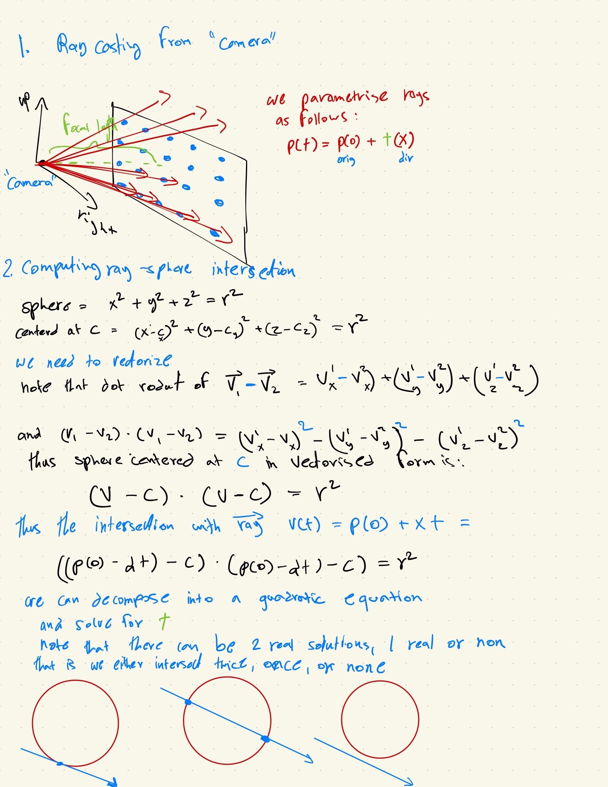
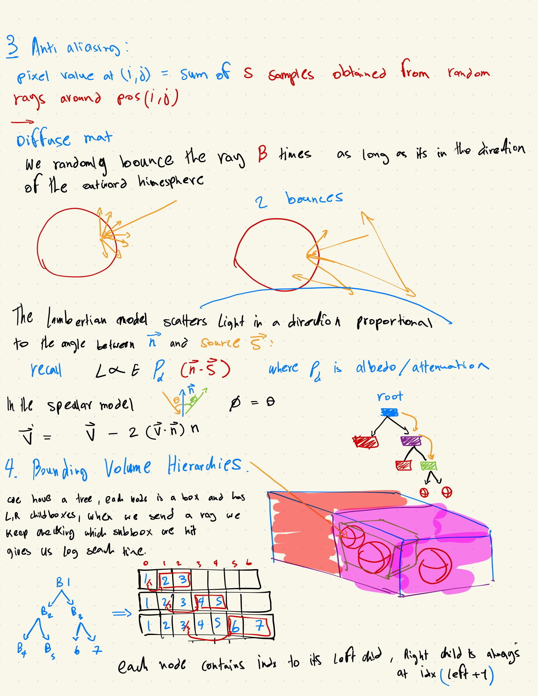

# Ray Tracer
This project is a minimal raytracer written from scratch in C++ and then ported to Cuda, focusing on ray-sphere intersection, shading models, and acceleration structures using a Bounding Volume Hierarchy (BVH).
The raytracer simulates how rays of light interact with a 3D scene. For each pixel `(i, j)` in the viewport, we cast `n` rays from the camera (origin). The direction of each ray is determined by the pixel's position, offset with a small random displacement to simulate anti-aliasing:

## Ray Coloring Logic

- **Background (Skybox)**: If the ray hits nothing, a constant background color is returned.
- **Hit Detection**: If a ray intersects an object, we determine the color based on the object's material properties:
  - **Diffuse**: Uses Lambertian reflection. The ray bounces in a random direction aligned with the surface normal, attenuated by an albedo value.
  - **Recursive Bounces**: Rays can recursively bounce up to `d` times to simulate multiple reflections or scattering.

Each ray tests for intersection by solving a **quadratic equation** against spheres. This can be computationally expensive, especially in static scenes with many objects.

## Optimization: Bounding Volume Hierarchy (BVH)

To accelerate ray-object intersection tests, we use a **Bounding Volume Hierarchy**:

### BVH Construction

1. **Root Box**: Encapsulate all primitives in a single bounding box.
2. **Split**: Divide the box into two sub-boxes along the midpoint of its longest axis.
3. **Partition**: Assign each primitive to the left or right child based on its center position.
4. **Recursion**: Repeat the process recursively until a max depth is reached.

Each bounding box is defined by two `vec3`s representing the min and max corners.

### BVH Node Storage

- Primitives are stored globally in an index array.
- Each BVH node stores:
  - Start index of its primitives
  - Count of primitives
- The global array is sorted such that each node's primitives are contiguous.

### Render

This image demonstrates simple lighting and shading, with some reflective spheres.

